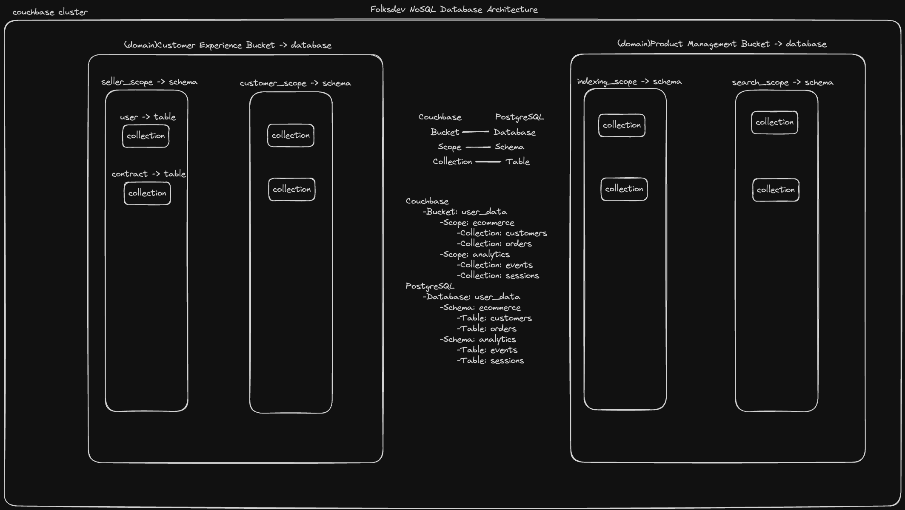

# Gocb Couchbase SDK

This repository contains the source code discussed in the [Gocb Couchbase SDK](https://www.youtube.com/watch?v=Ag7h63aEiaY&t=1s)
Here, we talked about what couchbase is, one of the nosql databases, how to implement couchbase and how to use gocb sdk with golang project

## Contents
- **Couchbase**:

- **Couchbase Server With Docker**:
    - Inside the [infra-setup -> docker-compose.yml](docker-compose.yml) directory, you can find couchbase docker image for running couchbase 
  on your locale machine
    - Open new terminal and Navigate to the infra-setup folder: Use the cd command to change the directory to your infra-setup folder. For example:
      `cd path/to/your/infra-setup`
    - Run the Docker Compose command: Execute the following command to bring up the Couchbase image: `docker-compose up`. This will start 
  the Couchbase service as defined in your docker-compose.yml file.
  
- **Connecting Local Couchbase Cluster**:
    - Inside the [internal -> folsdev-fiber-rest-api -> pkg -> couchbase](couchbase.go) directory, you can find sample code demonstrating 
  how to connect couchbase.

- **Database Operations**:
    - Inside the [internal -> folsdev-fiber-rest-api -> application -> repository](userRepository.go) directory, you can find sample code demonstrating
  for how to write query on couchbase database
     

## How to Use
- Before start to test example, be sure you're done [Requirements](../README.md) step

1. **Run Docker Compose File**:
    - Be sure you run [docker-compose.yml](docker-compose.yml) file
    - Check the localhost path on browser http://localhost:8091/ 

2. **Set Up Local Couchbase Server**:
    - Creating new bucket with name user
    - Defining new cluster role with access role covering whole buckets on cluster
    - Creating user bucket index for accesing data on collections

3. **Database Operations**:
    - To run the database operations Run the command `go run main.go` to execute the example.
    - Visit `http://localhost:8080` in your browser or use postman collection to trigger endpoint 

## Useful Documents
- **[Bucket & Scopes & Collections](https://docs.couchbase.com/cloud/clusters/data-service/about-buckets-scopes-collections.html)** 
- **[Gocb Github](https://github.com/couchbase/gocb)** 
- **[Gocb SDK Documentation](https://pkg.go.dev/github.com/couchbase/gocb/v2#section-readme)** 
- **[Couchbase Go SDK](https://docs.couchbase.com/go-sdk/current/hello-world/start-using-sdk.html)** 

